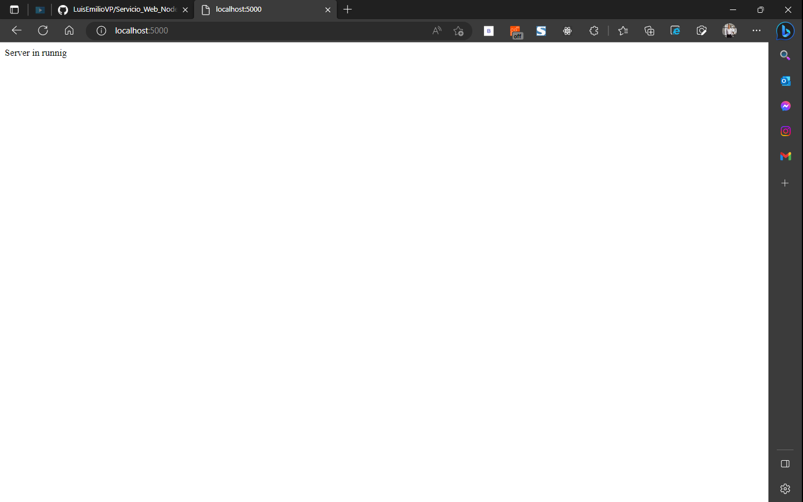
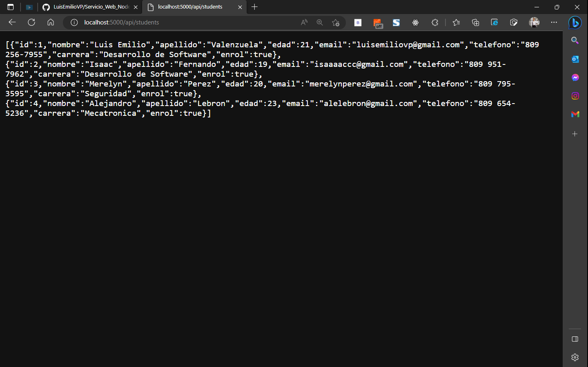
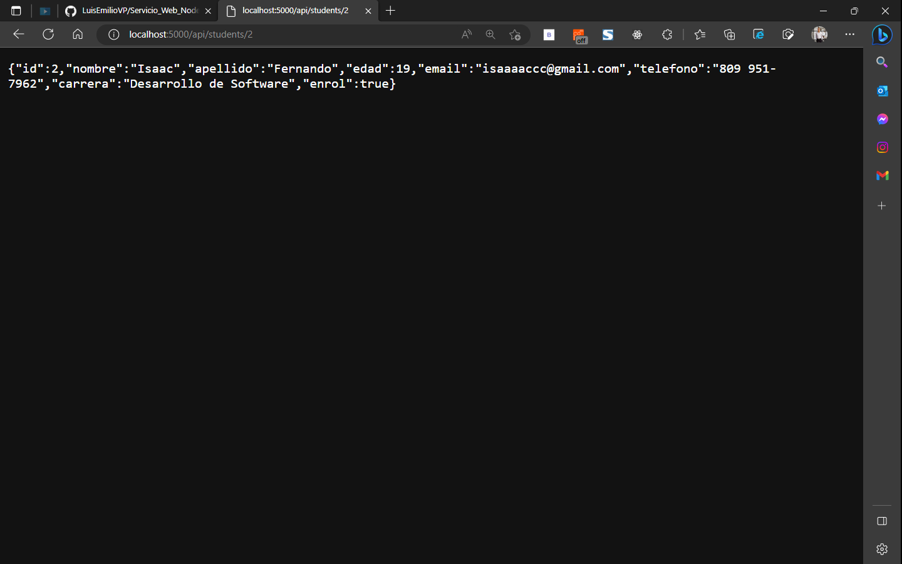
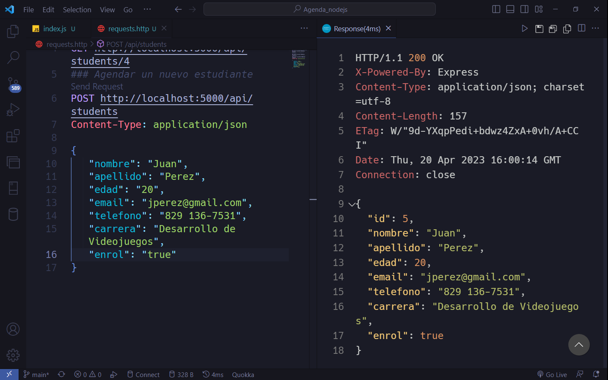

# Tarea 5: Agenda Multimedia Nodejs

#### 👨‍💻 Luis Emilio Valenzuela

## Descripción

Agenda multimedia desarrollado con nodejs y express, consumiendo una API para listar y guardar datos en la misma. Proyecto desarrollado para fines de estudios en la asignatura de Programación Web.

#### Listar

#### Listar por id

#### Guardar

## Tecnologías usadas

