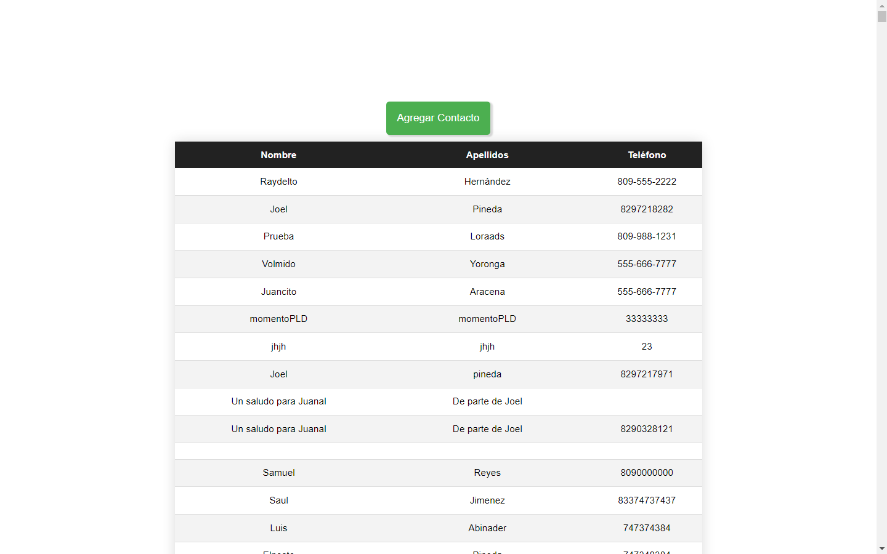
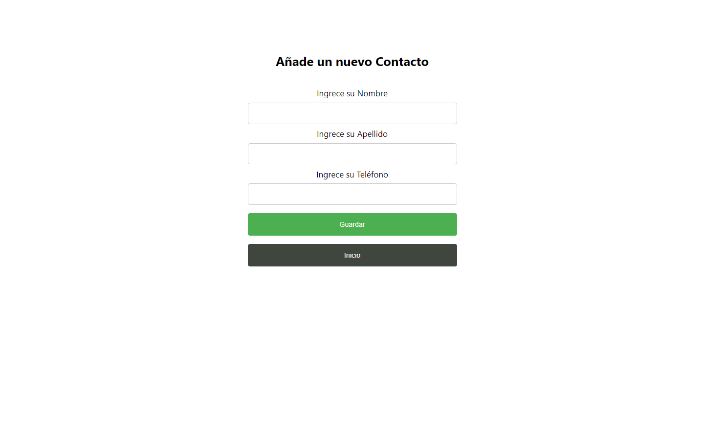
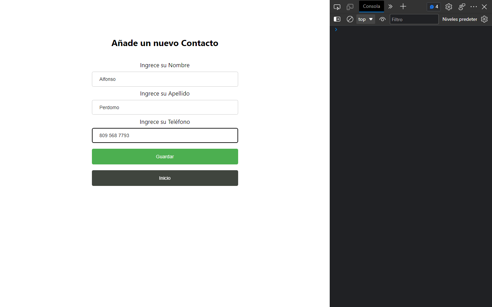
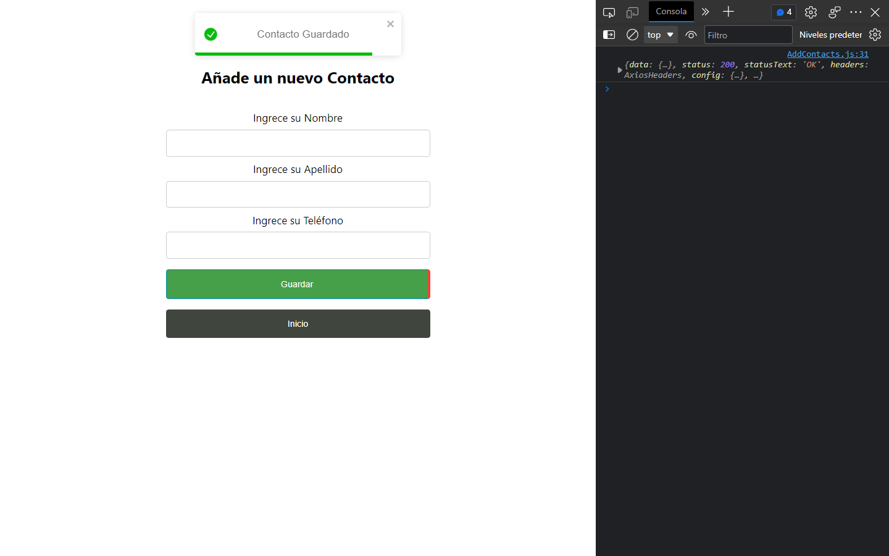
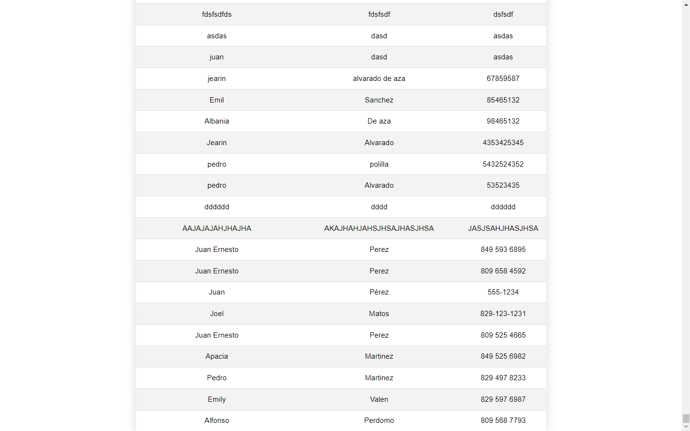

# Tarea 5: Agenda Multimedia Nodejs

#### 👨‍💻 Luis Emilio Valenzuela

## Descripción

Agenda multimedia desarrollado con nodejs y react, consumiendo una API para listar y guardar datos en la misma. Proyecto desarrollado para fines de estudios en la asignatura de Programación Web.

## Tecnologías usadas

